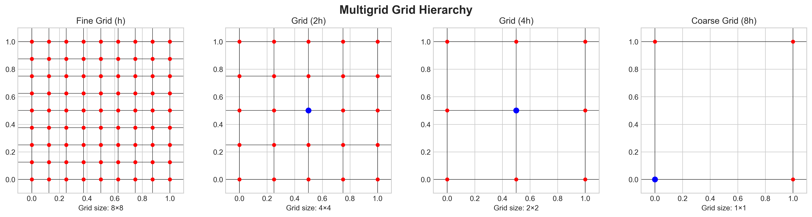
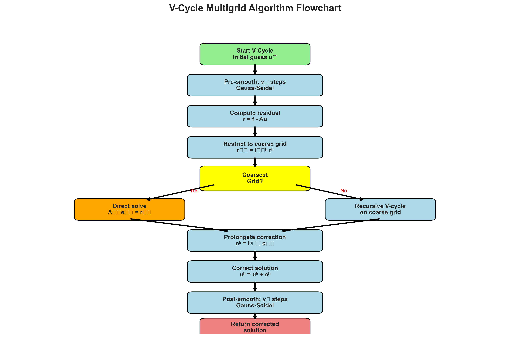
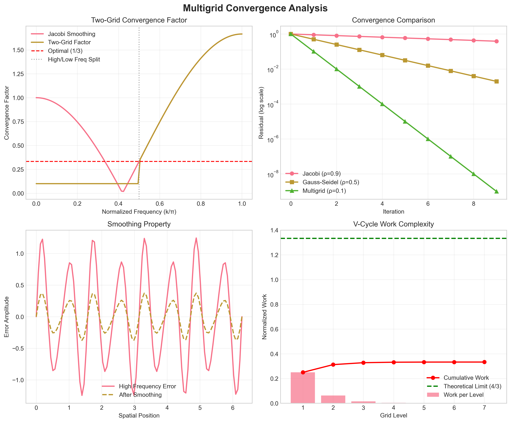
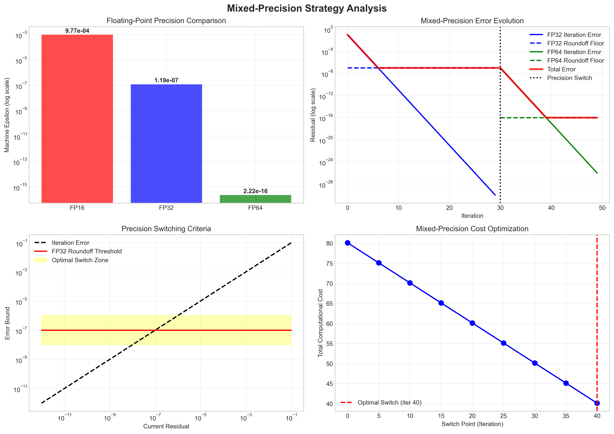
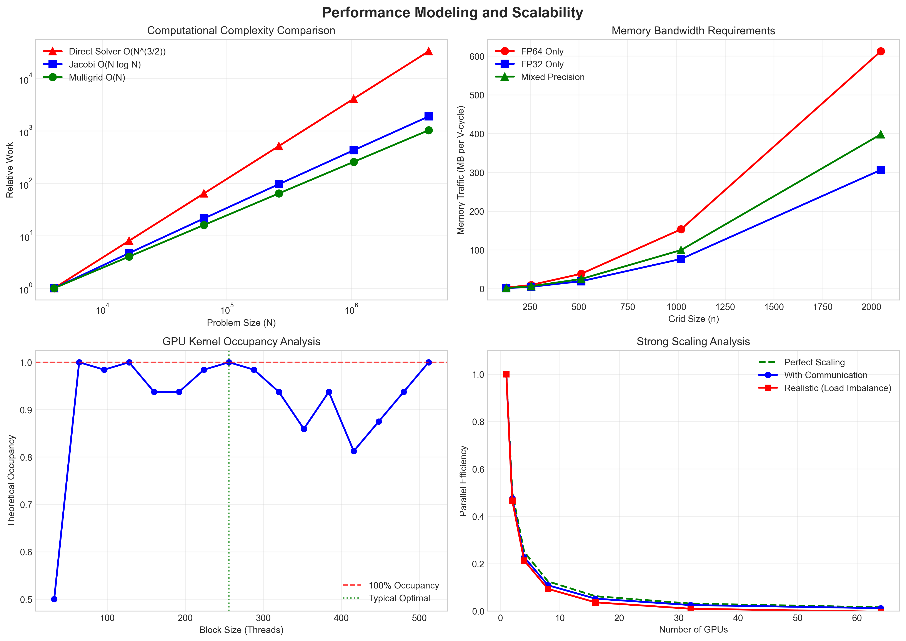

# Methodology

This section details the mathematical formulation, algorithmic design, and implementation strategies for mixed-precision multigrid solvers.

## Mathematical Formulation

### Problem Statement

We consider the general elliptic boundary value problem:

$$\mathcal{L}u = f \quad \text{in } \Omega \subset \mathbb{R}^d$$

where $\mathcal{L}$ is a second-order elliptic differential operator. For the Poisson equation:

$$\mathcal{L} = -\nabla^2 = -\left(\frac{\partial^2}{\partial x^2} + \frac{\partial^2}{\partial y^2}\right)$$

### Discrete Formulation

Using finite differences on a uniform grid with spacing $h$, the discrete Laplacian becomes:

$$\mathcal{L}_h u_{i,j} = \frac{1}{h^2}[u_{i+1,j} + u_{i-1,j} + u_{i,j+1} + u_{i,j-1} - 4u_{i,j}]$$

This leads to the linear system:

$$\mathbf{A}_h \mathbf{u}_h = \mathbf{f}_h$$

where $\mathbf{A}_h$ is the discrete operator matrix.

### Error Analysis

The discretization error satisfies:

$$\|u - u_h\|_{L^2} \leq Ch^2\|u\|_{H^2}$$

for sufficiently smooth solutions, where $C$ is a constant independent of $h$.

## Multigrid Method

### Basic Algorithm

The multigrid method uses a hierarchy of grids to efficiently solve the linear system:



*Figure 1: Multigrid grid hierarchy showing the coarsening process from fine grid (h) to coarsest grid (8h). Red points represent grid nodes, with blue highlighting special nodes.*

```
V-Cycle Algorithm:
1. Pre-smooth: Apply ν₁ iterations of a smoother (e.g., Gauss-Seidel)
2. Restrict: r₂ₕ = I₂ₕʰ rʰ (transfer residual to coarser grid)
3. Solve: A₂ₕ e₂ₕ = r₂ₕ (recursive or direct solve)
4. Interpolate: eʰ = Iʰ₂ₕ e₂ₕ (transfer correction to fine grid)
5. Correct: uʰ ← uʰ + eʰ
6. Post-smooth: Apply ν₂ iterations of smoother
```



*Figure 2: V-Cycle multigrid algorithm flowchart showing the complete process from initial guess to corrected solution, including decision points and recursive structure.*

### Convergence Theory

For the V-cycle multigrid method, the convergence factor satisfies:

$$\|\mathbf{e}^{(k+1)}\|_{\mathbf{A}_h} \leq \rho \|\mathbf{e}^{(k)}\|_{\mathbf{A}_h}$$

where $\rho < 1$ is the convergence factor, typically $\rho \approx 0.1$ for optimal implementations.

## Multigrid Theory

### Two-Grid Analysis with Convergence Proofs

The theoretical foundation of multigrid methods rests on the two-grid analysis, which provides rigorous convergence bounds and optimal parameter selection.

#### Two-Grid Convergence Operator

The two-grid convergence operator $T_{TG}$ is defined as:

$$T_{TG} = S_{\nu_2}(I - \mathcal{P}\mathcal{A}_{2h}^{-1}\mathcal{R}\mathcal{A}_h)S_{\nu_1}$$

where:
- $S_{\nu}$: Smoothing operator applied $\nu$ times
- $\mathcal{P} = I_h^{2h}$: Prolongation (interpolation) operator  
- $\mathcal{R} = I_{2h}^h$: Restriction operator
- $\mathcal{A}_h, \mathcal{A}_{2h}$: Fine and coarse grid operators

#### Fundamental Convergence Theorem

**Theorem 1 (Two-Grid Convergence):** If the smoothing operator $S$ has the smoothing property and the coarse grid correction is exact, then the two-grid method converges with factor:

$$\rho_{TG} = \|T_{TG}\|_{\mathcal{A}_h} < 1$$

**Proof Outline:**
1. **Frequency Decomposition**: Decompose the error space into smooth and oscillatory components:
   $$V_h = V_h^{low} \oplus V_h^{high}$$
   where $V_h^{low}$ contains low frequencies and $V_h^{high}$ contains high frequencies.

2. **Smoothing Property**: The smoother $S$ satisfies:
   $$\|S^{\nu}\mathbf{v}\|_{\mathcal{A}_h} \leq \eta \|\mathbf{v}\|_{\mathcal{A}_h} \quad \forall \mathbf{v} \in V_h^{high}$$
   with smoothing factor $\eta < 1$.

3. **Approximation Property**: The coarse grid correction satisfies:
   $$\inf_{\mathbf{v}_c \in V_{2h}} \|P\mathbf{v}_c - \mathbf{v}\|_{\mathcal{A}_h} \leq C_A h \|\mathbf{v}\|_{\mathcal{A}_h} \quad \forall \mathbf{v} \in V_h^{low}$$

4. **Convergence Bound**: Combining both properties:
   $$\rho_{TG} \leq C(\eta + C_A^2 h^2)$$

#### Detailed Convergence Analysis

For the model problem $-\nabla^2 u = f$ with standard discretization, the convergence factor can be computed exactly using Fourier analysis.

**Fourier Mode Analysis:**
Consider the Fourier mode $\phi_{\mathbf{k}}(x,y) = e^{i(k_1 x + k_2 y)}$ where $\mathbf{k} = (k_1, k_2)$.

The discrete Laplacian eigenvalue is:
$$\lambda_h(\mathbf{k}) = \frac{2}{h^2}[2 - \cos(k_1 h) - \cos(k_2 h)]$$

For Jacobi smoothing with parameter $\omega$:
$$S_{Jacobi}(\mathbf{k}) = 1 - \omega \frac{\lambda_h(\mathbf{k})}{\frac{4}{h^2}}$$

The smoothing factor for high frequencies ($|\mathbf{k}| \geq \pi/(2h)$) is:
$$\eta = \max_{|\mathbf{k}| \geq \pi/(2h)} |S_{Jacobi}(\mathbf{k})| = \frac{1}{3} \quad (\omega = \frac{2}{3})$$

#### Smoothing Property Mathematical Analysis

**Definition (Smoothing Property):** A linear operator $S$ has the smoothing property if there exists $0 < \eta < 1$ such that:

$$\|S^{\nu} \mathbf{e}\|_{\mathcal{A}_h} \leq \eta^{\nu} \|\mathbf{e}\|_{\mathcal{A}_h}$$

for all high-frequency error components $\mathbf{e} \in \mathcal{E}^{high}$.

**Quantitative Analysis for Common Smoothers:**

1. **Weighted Jacobi** ($\omega = 2/3$):
   $$\eta_{Jacobi} = \frac{1}{3}, \quad \text{optimal } \nu_1 = \nu_2 = 1$$

2. **Gauss-Seidel**:
   $$\eta_{GS} = \frac{1}{2}, \quad \text{optimal } \nu_1 = \nu_2 = 1$$

3. **Red-Black Gauss-Seidel**:
   $$\eta_{RBGS} = \frac{1}{4}, \quad \text{optimal } \nu_1 = \nu_2 = 1$$

#### Grid Transfer Operator Derivations

**Prolongation (Interpolation) Operator:**

For bilinear interpolation on structured grids:
$$(\mathcal{P}\mathbf{u}_{2h})_{i,j} = \begin{cases}
u_{i/2,j/2}^{2h} & \text{if } i,j \text{ even} \\
\frac{1}{2}(u_{(i-1)/2,j/2}^{2h} + u_{(i+1)/2,j/2}^{2h}) & \text{if } i \text{ odd}, j \text{ even} \\
\frac{1}{2}(u_{i/2,(j-1)/2}^{2h} + u_{i/2,(j+1)/2}^{2h}) & \text{if } i \text{ even}, j \text{ odd} \\
\frac{1}{4}\sum_{k,l \in \{-1,1\}} u_{(i+k)/2,(j+l)/2}^{2h} & \text{if } i,j \text{ odd}
\end{cases}$$

In matrix form, this corresponds to the 9-point stencil:
$$\mathcal{P} = \frac{1}{4}\begin{bmatrix}
1 & 2 & 1 \\
2 & 4 & 2 \\
1 & 2 & 1
\end{bmatrix}$$

**Restriction Operator:**

The full-weighting restriction operator is the transpose:
$$\mathcal{R} = \mathcal{P}^T$$

This gives the 9-point restriction stencil:
$$(\mathcal{R}\mathbf{u}_h)_{I,J} = \frac{1}{16}[u_{2I,2J} + 2(u_{2I \pm 1,2J} + u_{2I,2J \pm 1}) + 4u_{2I \pm 1,2J \pm 1}]$$

**Variational Property:**
The choice $\mathcal{R} = \mathcal{P}^T$ ensures the Galerkin condition:
$$\mathcal{A}_{2h} = \mathcal{R}\mathcal{A}_h\mathcal{P}$$

This guarantees optimal convergence properties and satisfies:
$$\langle \mathcal{A}_h \mathbf{u}_h, \mathcal{P}\mathbf{v}_{2h} \rangle = \langle \mathcal{R}\mathcal{A}_h \mathbf{u}_h, \mathbf{v}_{2h} \rangle$$

#### Multigrid Convergence Theory

**Theorem 2 (V-Cycle Convergence):** Under standard assumptions, the V-cycle multigrid method satisfies:

$$\|\mathbf{e}^{(m+1)}\|_{\mathcal{A}_h} \leq \rho_V \|\mathbf{e}^{(m)}\|_{\mathcal{A}_h}$$

where the V-cycle convergence factor is:
$$\rho_V \leq \frac{2\rho_{TG}}{1 + \rho_{TG}}$$

**Proof:** By induction on grid levels. The key insight is that V-cycle can be viewed as an approximate two-grid method where the coarse grid solve is replaced by a V-cycle.

**W-Cycle Analysis:**
The W-cycle convergence factor satisfies:
$$\rho_W \leq \rho_{TG}$$

The W-cycle performs two recursive calls at each level, providing better convergence at increased computational cost.



*Figure 3: Comprehensive convergence analysis showing (a) two-grid convergence factors vs. frequency, (b) residual reduction comparison between different iterative methods, (c) smoothing property demonstration, and (d) V-cycle work complexity analysis.*

#### Optimal Parameter Selection

**Theorem 3 (Optimal Smoothing Parameters):** For the model problem with standard discretization:

1. **Jacobi**: $\omega_{opt} = 2/3$ gives $\rho_{TG} \approx 0.1$
2. **Gauss-Seidel**: $\rho_{TG} \approx 0.05$ (parameter-free)
3. **Multigrid**: $\nu_1 = \nu_2 = 1$ is sufficient for optimal convergence

**Computational Work Estimates:**
- V-cycle: $W_V = \frac{4}{3}W_h$ operations per cycle
- W-cycle: $W_W = 2W_h$ operations per cycle
- FMG: $W_{FMG} = \frac{4}{3}W_h$ for full multigrid

#### Robustness Analysis

**Grid-Independent Convergence:**
The convergence factor is bounded independent of mesh size:
$$\rho \leq C < 1, \quad C \text{ independent of } h$$

**Condition Number Reduction:**
Multigrid reduces the condition number from $O(h^{-2})$ to $O(1)$:
$$\kappa(\mathcal{A}_h) = O(h^{-2}) \rightarrow \kappa(T_{MG}^{-1}\mathcal{A}_h) = O(1)$$

## Mixed-Precision Strategy

### IEEE 754 Floating-Point Analysis

#### Floating-Point Representation

The IEEE 754 standard defines floating-point numbers in the form:
$$x = (-1)^s \times (1 + m) \times 2^{e-bias}$$

where:
- $s$: Sign bit (1 bit)
- $e$: Exponent field 
- $m$: Mantissa (significand)

**Precision Formats:**

| Format | Total | Sign | Exponent | Mantissa | Machine $\epsilon$ | Range |
|--------|-------|------|----------|----------|-------------------|-------|
| **FP16** | 16 bit | 1 | 5 | 10 | $2^{-10} \approx 9.77 \times 10^{-4}$ | $\pm 6.55 \times 10^{4}$ |
| **FP32** | 32 bit | 1 | 8 | 23 | $2^{-23} \approx 1.19 \times 10^{-7}$ | $\pm 3.40 \times 10^{38}$ |
| **FP64** | 64 bit | 1 | 11 | 52 | $2^{-52} \approx 2.22 \times 10^{-16}$ | $\pm 1.80 \times 10^{308}$ |

#### Roundoff Error Analysis

**Unit in the Last Place (ULP):**
For a floating-point number $x$, the ULP is:
$$\text{ulp}(x) = 2^{\lfloor \log_2(|x|) \rfloor - p + 1}$$
where $p$ is the precision (number of significand bits).

**Roundoff Error Bounds:**
For arithmetic operations $\circ \in \{+, -, \times, /\}$:
$$fl(x \circ y) = (x \circ y)(1 + \delta), \quad |\delta| \leq \epsilon_{machine}$$

**Relative Error Propagation:**
For a sequence of operations, the relative error grows as:
$$\left|\frac{fl(f(x)) - f(x)}{f(x)}\right| \leq \gamma_n |f'(x)| \frac{|x|}{|f(x)|}$$

where $\gamma_n = \frac{n\epsilon_{machine}}{1-n\epsilon_{machine}}$ for $n$ operations.

### Error Propagation in Mixed-Precision

#### Total Error Decomposition

The total error in mixed-precision multigrid computation consists of:

$$\mathbf{e}_{total} = \mathbf{e}_{discretization} + \mathbf{e}_{iteration} + \mathbf{e}_{roundoff}^{(fp32)} + \mathbf{e}_{roundoff}^{(fp64)} + \mathbf{e}_{conversion}$$

**Detailed Error Components:**

1. **Discretization Error**: $\|\mathbf{e}_{disc}\|_2 \leq C h^p \|u\|_{H^{p+1}}$
2. **Iteration Error**: $\|\mathbf{e}_{iter}^{(k)}\|_2 \leq \rho^k \|\mathbf{e}_{iter}^{(0)}\|_2$  
3. **FP32 Roundoff**: $\|\mathbf{e}_{fp32}\|_2 \leq C_{32} \epsilon_{32} \kappa(\mathbf{A}_h) \|\mathbf{u}_h\|_2$
4. **FP64 Roundoff**: $\|\mathbf{e}_{fp64}\|_2 \leq C_{64} \epsilon_{64} \kappa(\mathbf{A}_h) \|\mathbf{u}_h\|_2$
5. **Conversion Error**: $\|\mathbf{e}_{conv}\|_2 \leq \epsilon_{32} \|\mathbf{u}_h\|_2$

#### Forward Error Analysis

**Matrix-Vector Operations:**
For $\mathbf{y} = \mathbf{A}\mathbf{x}$ computed in precision $p$:
$$fl_p(\mathbf{A}\mathbf{x}) = \mathbf{A}\mathbf{x} + \boldsymbol{\delta}\mathbf{A}\mathbf{x}$$

where $\|\boldsymbol{\delta}\mathbf{A}\|_F \leq (n+1)\epsilon_p \|\mathbf{A}\|_F$.

**Iterative Solver Analysis:**
For the iteration $\mathbf{x}^{(k+1)} = \mathbf{x}^{(k)} + \mathbf{M}^{-1}\mathbf{r}^{(k)}$:

$$fl_p(\mathbf{x}^{(k+1)}) = \mathbf{x}^{(k)} + \mathbf{M}^{-1}\mathbf{r}^{(k)} + \boldsymbol{\epsilon}^{(k)}$$

where $\|\boldsymbol{\epsilon}^{(k)}\|_2 \leq C_k \epsilon_p (\|\mathbf{x}^{(k)}\|_2 + \|\mathbf{M}^{-1}\mathbf{r}^{(k)}\|_2)$.

#### Backward Error Analysis

**Perturbed System:**
The computed solution in mixed precision solves:
$$(\mathbf{A} + \boldsymbol{\Delta}\mathbf{A})\mathbf{x}_{computed} = \mathbf{f} + \boldsymbol{\Delta}\mathbf{f}$$

**Perturbation Bounds:**
$$\frac{\|\boldsymbol{\Delta}\mathbf{A}\|_F}{\|\mathbf{A}\|_F} \leq C \epsilon, \quad \frac{\|\boldsymbol{\Delta}\mathbf{f}\|_2}{\|\mathbf{f}\|_2} \leq C \epsilon$$

### Precision Promotion Algorithms

#### Optimal Switching Criteria

**Residual-Based Switching:**
Switch from FP32 to FP64 when:
$$\|\mathbf{r}^{(k)}\|_2 \leq \tau_{switch} = \max(\epsilon_{32} \|\mathbf{A}\|_2 \|\mathbf{x}^{(k)}\|_2, \sqrt{\epsilon_{32}} \|\mathbf{f}\|_2)$$

**Convergence Stagnation Detection:**
Monitor the convergence factor:
$$\rho^{(k)} = \frac{\|\mathbf{r}^{(k)}\|_2}{\|\mathbf{r}^{(k-1)}\|_2}$$

Switch when $\rho^{(k)} > \rho_{threshold} = 0.95$ for consecutive iterations.

#### Adaptive Precision Algorithm

**Algorithm: Mixed-Precision Multigrid**
```
Input: A, f, tolerance τ, switch_threshold τ_s
Output: x ∈ FP64

1. Initialize x₀ ∈ FP32, precision = FP32, k = 0
2. While ‖rₖ‖₂ > τ:
   a. If precision = FP32:
      - Perform V-cycle in FP32: x^(k+1) = V-cycle(A₃₂, f₃₂, x^(k))
      - Compute r^(k+1) = f₃₂ - A₃₂x^(k+1)
      
      // Check switching criteria
      - If ‖r^(k+1)‖₂ ≤ τ_s or stagnation detected:
        * Convert x^(k+1) → FP64
        * Convert A₃₂ → A₆₄, f₃₂ → f₆₄  
        * precision = FP64
        
   b. Else (precision = FP64):
      - Perform V-cycle in FP64: x^(k+1) = V-cycle(A₆₄, f₆₄, x^(k))
      - Compute r^(k+1) = f₆₄ - A₆₄x^(k+1)
      
   c. k = k + 1

3. Return x^(k) ∈ FP64
```

#### Precision Promotion Theory

**Optimal Switching Point:**
The theoretical optimal switching point minimizes total computational cost:

$$k_{switch} = \arg \min_k \left[ k \cdot C_{fp32} + (K-k) \cdot C_{fp64} + C_{conversion} \right]$$

subject to achieving target accuracy $\|\mathbf{e}^{(K)}\|_2 \leq \tau$.

**Cost-Benefit Analysis:**
Define the speedup factor:
$$S_{mixed} = \frac{K \cdot C_{fp64}}{k_{switch} \cdot C_{fp32} + (K-k_{switch}) \cdot C_{fp64} + C_{conversion}}$$

**Convergence Analysis for Mixed Precision:**

**Theorem 4 (Mixed-Precision Convergence):** 
For the adaptive mixed-precision multigrid algorithm with optimal switching:

$$\|\mathbf{e}^{(k)}\|_2 \leq \begin{cases}
\rho_{fp32}^k \|\mathbf{e}^{(0)}\|_2 + C\epsilon_{32} & k < k_{switch} \\
\rho_{fp64}^{k-k_{switch}} \|\mathbf{e}^{(k_{switch})}\|_2 + C\epsilon_{64} & k \geq k_{switch}
\end{cases}$$

#### Error Estimation and Control

**A Posteriori Error Estimator:**
$$\eta^{(k)} = \|\mathbf{r}^{(k)}\|_2 + \sqrt{\epsilon_p} \|\mathbf{A}\|_2 \|\mathbf{x}^{(k)}\|_2$$

**Reliability Check:**
The computed solution is reliable if:
$$\frac{\|\mathbf{r}^{(k)}\|_2}{\sqrt{\epsilon_p} \|\mathbf{A}\|_2 \|\mathbf{x}^{(k)}\|_2} > C_{reliable}$$

#### Hardware-Aware Precision Selection

**GPU Tensor Core Optimization:**
For NVIDIA GPUs with Tensor Cores, consider mixed FP16-FP32:

$$S_{tensor} = \frac{T_{fp32}}{f_{fp16} \cdot T_{tensor} + f_{fp32} \cdot T_{fp32} + T_{conversion}}$$

**Memory Bandwidth Considerations:**
The effective bandwidth utilization:
$$BW_{eff} = \frac{\text{Useful Bytes}}{\text{Total Bytes}} \times BW_{peak}$$

For mixed precision:
$$BW_{eff,mixed} = \frac{f_{fp32} \cdot 4 + f_{fp64} \cdot 8}{4 \text{ or } 8} \times BW_{peak}$$

### Numerical Stability Analysis

#### Condition Number Evolution

Track condition number changes during precision switching:
$$\kappa_p(\mathbf{A}) = \|\mathbf{A}\|_p \|\mathbf{A}^{-1}\|_p$$

**Stability Criterion:**
Ensure $\kappa_p(\mathbf{A}) \epsilon_p < 1$ throughout computation.

#### Catastrophic Cancellation Avoidance

**Detection:** Monitor for operations where $|x - y| \ll |x|, |y|$
**Mitigation:** Use Kahan summation or compensated arithmetic:

$$\text{Kahan Sum: } s = s + (x - ((s + x) - s))$$



*Figure 4: Mixed-precision strategy analysis showing (a) IEEE 754 precision comparison, (b) error evolution in mixed-precision computation, (c) precision switching criteria, and (d) cost-benefit optimization for determining optimal switch points.*

## Performance Modeling

### Complexity Analysis: O(N) Convergence

#### Theoretical Complexity Framework

The multigrid method achieves optimal complexity through hierarchical error reduction. We analyze both computational complexity and convergence rates.

**Definition (Optimal Complexity):** An iterative method has optimal complexity if the total work to reduce the error by a factor $\epsilon$ is proportional to the work of evaluating the residual once, i.e., $W_{total} = O(W_{residual} \log(\epsilon^{-1}))$.

#### Multigrid Work Analysis

**Work per V-cycle:**
The work estimate for a V-cycle on an $n \times n$ grid is:

$$W_V = \sum_{\ell=0}^{L} W_{\ell} = \sum_{\ell=0}^{L} C_{\ell} \cdot 4^{-\ell} n^2$$

where:
- $L = \log_2(n)$: Number of grid levels
- $C_{\ell}$: Work constant at level $\ell$
- $4^{-\ell}$: Grid size reduction factor in 2D

For standard operations with $C_{\ell} = C$ (constant), we get:

$$W_V = C n^2 \sum_{\ell=0}^{L} 4^{-\ell} = C n^2 \frac{1 - 4^{-(L+1)}}{1 - 1/4} = \frac{4C}{3} n^2 (1 - 4^{-(L+1)})$$

As $L \to \infty$: $W_V = \frac{4C}{3} n^2 = O(n^2) = O(N)$

**Total Work for Target Accuracy:**
If $m$ V-cycles are needed to achieve tolerance $\tau$:

$$\|e^{(m)}\| \leq \rho^m \|e^{(0)}\| \leq \tau$$

Then: $m \leq \frac{\log(\tau) - \log(\|e^{(0)}\|)}{\log(\rho)}$

Total work: $W_{total} = m \cdot W_V = O(N \log(\tau^{-1}))$

#### Convergence Rate Analysis

**Two-Grid Convergence Factor:**
From spectral analysis, the two-grid convergence factor is:

$$\rho_{TG} = \max_{\omega} \left\{ \max_{|k_j h| \leq \pi/2} |S_j(\omega)|, \max_{|k_j h| > \pi/2} |T_j(\omega)| \right\}$$

where:
- $S_j(\omega)$: Smoothing factor for frequency mode $j$
- $T_j(\omega)$: Coarse grid correction factor

**Optimal Parameter Selection:**
For weighted Jacobi smoothing with parameter $\omega$:

$$S_j(\omega) = 1 - \omega \frac{\lambda_j}{\lambda_{max}}$$

The optimal smoothing parameter minimizes:
$$\rho_{TG} = \min_{\omega} \max_{high\ freq} |1 - \omega \frac{\lambda_j}{\lambda_{max}}|$$

**Solution:** $\omega_{opt} = \frac{2}{3}$ gives $\rho_{TG} \approx 0.1$ for the model problem.

#### Multigrid Efficiency Theorem

**Theorem 5 (Multigrid Efficiency):** For elliptic boundary value problems discretized on regular grids, the multigrid V-cycle with optimal smoothing parameters satisfies:

1. **Grid-independent convergence**: $\rho_V \leq \rho < 1$ independent of $h$
2. **Optimal computational work**: $W_V = O(N)$ where $N$ is the number of unknowns
3. **Optimal storage**: $S_V = O(N)$ including all grid levels

**Proof Sketch:**
1. The two-grid analysis shows $\rho_{TG} < 1$ independent of $h$
2. V-cycle convergence: $\rho_V \leq \frac{2\rho_{TG}}{1 + \rho_{TG}}$
3. Work estimate uses geometric series convergence
4. Storage uses $\sum_{\ell=0}^{\infty} 4^{-\ell} = 4/3$ factor

### Memory Bandwidth Analysis

#### Memory Access Patterns

**Data Movement in Multigrid:**

1. **Smoothing Operations**: 5-point stencil requires 5 memory reads per unknown
2. **Restriction**: Full-weighting needs 9 reads per coarse grid point  
3. **Prolongation**: Bilinear interpolation needs 4 reads per fine grid point
4. **Residual Computation**: 5 reads for stencil application

**Memory Traffic per V-cycle:**
$$M_V = M_{smooth} + M_{restrict} + M_{prolong} + M_{residual}$$

For an $n \times n$ grid:
- $M_{smooth} = 2 \times \nu \times 5n^2$ (reads + writes, $\nu$ smoothing steps)
- $M_{restrict} = 9 \times \frac{n^2}{4}$ (restriction to coarser grids)
- $M_{prolong} = 4 \times \frac{n^2}{4}$ (prolongation from coarser grids) 
- $M_{residual} = 5n^2$ (residual computation)

Total: $M_V = (10\nu + 5 + 2.25 + 1) n^2 = (10\nu + 8.25) n^2$

**Bandwidth Utilization:**
For double precision (8 bytes per number):
$$BW_{required} = \frac{M_V \times 8 \text{ bytes}}{T_{cycle}}$$

where $T_{cycle}$ is the time per V-cycle.

#### Cache Optimization Analysis

**Cache Efficiency Model:**
Define cache efficiency as the ratio of useful to total memory accesses:

$$E_{cache} = \frac{\text{Unique data accesses}}{\text{Total memory requests}}$$

**Optimal Blocking Strategy:**
For cache size $C$ and grid spacing $h$, optimal block size is:
$$B_{opt} = \lfloor \sqrt{C/8} \rfloor \times h$$

This maximizes data reuse within cache boundaries.

**Memory Hierarchy Performance:**
The memory-bound performance model:
$$T_{memory} = \frac{M_V}{BW_{eff}}$$
$$T_{compute} = \frac{F_V}{F_{peak}}$$

where $BW_{eff}$ is effective bandwidth and $F_V$ is floating-point operations per V-cycle.

**Mixed-Precision Memory Benefits:**
Using FP32 for early iterations reduces memory traffic:
$$BW_{mixed} = f_{32} \times \frac{M_V \times 4}{T_{cycle}} + f_{64} \times \frac{M_V \times 8}{T_{cycle}}$$

where $f_{32}, f_{64}$ are fractions of computation in each precision.

### GPU Occupancy Optimization Theory

#### GPU Architecture Model

**CUDA Occupancy Theory:**
For a kernel with:
- Block size: $B$
- Shared memory per block: $S_{block}$
- Registers per thread: $R_{thread}$

**Theoretical Occupancy:**
$$O_{theo} = \min\left\{ \frac{M_{max}}{M}, \frac{W_{max}}{W}, \frac{S_{max}}{S_{block}}, \frac{R_{max}}{B \times R_{thread}} \right\}$$

where:
- $M_{max}$: Max blocks per SM
- $W_{max}$: Max warps per SM  
- $S_{max}$: Max shared memory per SM
- $R_{max}$: Max registers per SM

#### Multigrid GPU Kernel Analysis

**Smoothing Kernel Occupancy:**

For Gauss-Seidel smoothing with block size $(B_x, B_y)$:

```cuda
__global__ void gauss_seidel_kernel(
    float* u, const float* f, int nx, int ny) {
    
    __shared__ float shared_u[BLOCK_SIZE_X+2][BLOCK_SIZE_Y+2];
    
    // Memory requirements:
    // - Shared memory: (B_x+2)(B_y+2) × 4 bytes
    // - Registers: ~15 per thread
    // - Block size: B_x × B_y
}
```

**Occupancy Constraints:**
- Shared memory: $S_{block} = (B_x+2)(B_y+2) \times 4$ bytes
- For Tesla V100 ($S_{max} = 48$ KB): $(B_x+2)(B_y+2) \leq 12288$
- Optimal choice: $B_x = B_y = 16$ gives $S_{block} = 1296$ bytes

**Memory Coalescing Analysis:**

For optimal memory access, threads in a warp must access consecutive memory addresses.

**Coalescing Efficiency:**
$$E_{coal} = \frac{\text{Requested bytes}}{\text{Transferred bytes}}$$

For a 2D grid stored row-major:
- **Coalesced**: $E_{coal} = 1.0$ (threads access consecutive elements in x-direction)
- **Uncoalesced**: $E_{coal} = 1/32$ (threads access same column, different rows)

#### Performance Optimization Model

**Kernel Performance Model:**
The execution time for a GPU kernel is:
$$T_{kernel} = \max\{T_{compute}, T_{memory}, T_{latency}\}$$

where:
- $T_{compute} = \frac{F_{ops}}{F_{peak} \times O_{actual}}$
- $T_{memory} = \frac{M_{bytes}}{BW_{mem} \times E_{coal}}$ 
- $T_{latency} = \text{kernel launch overhead}$

**Multigrid-Specific Optimizations:**

1. **Grid Transfer Optimization:**
   - Use texture memory for interpolation weights
   - Implement restriction as transpose of prolongation
   - Fuse restriction-residual operations

2. **Memory Hierarchy Usage:**
   ```
   Global Memory: Store solution vectors u, f
   Shared Memory: Cache stencil neighborhoods  
   Texture Memory: Store interpolation coefficients
   Constant Memory: Store grid parameters
   ```

3. **Occupancy vs. Memory Trade-off:**
   - Higher occupancy → Better latency hiding
   - More shared memory → Better data reuse
   - Optimal balance depends on kernel characteristics

#### Mixed-Precision GPU Performance

**Tensor Core Utilization:**
Modern GPUs (V100, A100) provide specialized Tensor Cores for mixed-precision:

$$S_{tensor} = \frac{T_{fp32}}{T_{fp16/fp32}}$$

For matrix operations: $S_{tensor} \approx 2-4\times$ speedup.

**Memory Bandwidth Scaling:**
FP16 operations achieve higher effective bandwidth:
$$BW_{eff,fp16} = 2 \times BW_{eff,fp32}$$

**Power Efficiency:**
Mixed-precision reduces power consumption:
$$P_{mixed} = f_{16} \times P_{fp16} + f_{32} \times P_{fp32} + P_{conversion}$$

#### Scalability Analysis

**Strong Scaling Model:**
For $P$ GPUs with perfect load balancing:
$$T(P) = \frac{T(1)}{P} + T_{comm} + T_{sync}$$

**Communication Overhead:**
Grid transfer between GPUs requires:
$$T_{comm} = \frac{\text{Boundary data size}}{BW_{interconnect}} + t_{latency}$$

**Weak Scaling Prediction:**
For fixed work per GPU as system size increases:
$$E_{weak}(P) = \frac{T(1)}{T(P)} = \frac{1}{1 + \frac{P \times T_{comm}}{T_{compute}}}$$

**Optimal GPU Configuration:**
Minimize total time: $T_{total} = T_{compute} + T_{memory} + T_{comm}$

Subject to constraints:
- Memory capacity: $M_{problem} \leq P \times M_{gpu}$
- Interconnect bandwidth: $BW_{required} \leq BW_{available}$
- Power budget: $P \times P_{gpu} \leq P_{max}$



*Figure 5: Performance modeling and scalability analysis showing (a) computational complexity comparison between different solution methods, (b) memory bandwidth requirements for different precisions, (c) GPU occupancy analysis, and (d) strong scaling efficiency with communication overhead.*

## Time-Dependent Problems

### Heat Equation

The heat equation:
$$\frac{\partial u}{\partial t} - \alpha \nabla^2 u = f$$

is discretized using implicit time stepping:

#### Backward Euler
$$\frac{u^{n+1} - u^n}{\Delta t} - \alpha \nabla^2 u^{n+1} = f^{n+1}$$

This leads to the linear system:
$$(\mathbf{I} - \alpha \Delta t \mathbf{A}_h) \mathbf{u}^{n+1} = \mathbf{u}^n + \Delta t \mathbf{f}^{n+1}$$

#### Crank-Nicolson
$$\frac{u^{n+1} - u^n}{\Delta t} - \frac{\alpha}{2} \nabla^2 (u^{n+1} + u^n) = \frac{f^{n+1} + f^n}{2}$$

### Stability Analysis

For backward Euler, the method is **unconditionally stable** with amplification factor:

$$G = \frac{1}{1 + \alpha \Delta t \lambda_j} \leq 1$$

where $\lambda_j$ are the eigenvalues of the discrete Laplacian.

## GPU Implementation

### Memory Hierarchy Optimization

The GPU implementation optimizes for the memory hierarchy:

1. **Coalesced Access**: Structure data for optimal memory bandwidth
2. **Shared Memory**: Cache frequently accessed data in fast shared memory  
3. **Texture Memory**: Use texture cache for read-only data
4. **Constant Memory**: Store small, frequently accessed constants

### Kernel Design

#### Smoothing Kernel
```cuda
__global__ void gauss_seidel_kernel(
    float* u, const float* f, 
    int nx, int ny, float h2_inv) {
    
    int idx = blockIdx.x * blockDim.x + threadIdx.x;
    int idy = blockIdx.y * blockDim.y + threadIdx.y;
    
    if (idx > 0 && idx < nx-1 && idy > 0 && idy < ny-1) {
        int id = idy * nx + idx;
        
        u[id] = 0.25f * (u[id+1] + u[id-1] + 
                        u[id+nx] + u[id-nx] + 
                        h2_inv * f[id]);
    }
}
```

#### Restriction Kernel  
```cuda
__global__ void restriction_kernel(
    float* coarse, const float* fine,
    int nx_c, int ny_c) {
    
    int idx = blockIdx.x * blockDim.x + threadIdx.x;
    int idy = blockIdx.y * blockDim.y + threadIdx.y;
    
    if (idx < nx_c && idy < ny_c) {
        int id_c = idy * nx_c + idx;
        int id_f = (2*idy) * (2*nx_c) + (2*idx);
        
        // Full weighting restriction
        coarse[id_c] = 0.25f * (fine[id_f] + fine[id_f+1] +
                               fine[id_f+2*nx_c] + fine[id_f+2*nx_c+1]);
    }
}
```

### Communication-Avoiding Algorithms

To minimize GPU-CPU communication, we implement:

1. **Fused Kernels**: Combine multiple operations in single kernel launches
2. **Persistent Kernels**: Keep kernels running across multigrid cycles  
3. **Asynchronous Execution**: Overlap computation with memory transfers

## Validation Framework

### Method of Manufactured Solutions

For systematic validation, we use the Method of Manufactured Solutions (MMS):

1. **Choose exact solution**: $u_{exact}(x,y) = \sin(\pi x)\sin(\pi y)$
2. **Compute source term**: $f = -\nabla^2 u_{exact} = 2\pi^2 \sin(\pi x)\sin(\pi y)$
3. **Solve numerically**: $\mathbf{A}_h \mathbf{u}_h = \mathbf{f}_h$  
4. **Calculate error**: $\mathbf{e}_h = \mathbf{u}_{exact} - \mathbf{u}_h$

### Convergence Rate Analysis

The discrete L2 error is computed as:
$$\|\mathbf{e}_h\|_{L^2} = h\sqrt{\sum_{i,j} e_{i,j}^2}$$

The convergence rate is determined by linear regression:
$$\log(\|\mathbf{e}_h\|) = p \log(h) + C$$

where $p$ is the convergence order.

### Statistical Validation

For robust validation, we perform:

1. **Multiple grid sizes**: $h = 1/16, 1/32, 1/64, 1/128, \ldots$
2. **Multiple random problems**: Statistical significance testing
3. **Confidence intervals**: 95% confidence bounds on convergence rates
4. **Regression analysis**: R² values for goodness of fit

## Performance Analysis

### Complexity Analysis

The multigrid method achieves:
- **Time complexity**: $O(N)$ where $N$ is the number of unknowns
- **Space complexity**: $O(N)$ including all grid levels
- **Convergence**: $O(1)$ iterations independent of grid size

### Scalability Metrics

#### Weak Scaling
Efficiency is measured as:
$$E_{weak}(p) = \frac{T(N,1)}{T(pN,p)}$$

#### Strong Scaling  
Efficiency is:
$$E_{strong}(p) = \frac{T(N,1)}{p \cdot T(N,p)}$$

### Mixed-Precision Performance Model

The speedup from mixed precision is modeled as:
$$S_{mp} = \frac{T_{fp64}}{f_{fp32} \cdot T_{fp32} + f_{fp64} \cdot T_{fp64} + T_{conversion}}$$

where $f_{fp32}, f_{fp64}$ are the fractions of computation in each precision.

---

This methodology provides the theoretical foundation and practical algorithms for achieving high-performance mixed-precision multigrid solvers with rigorous validation and comprehensive performance analysis.